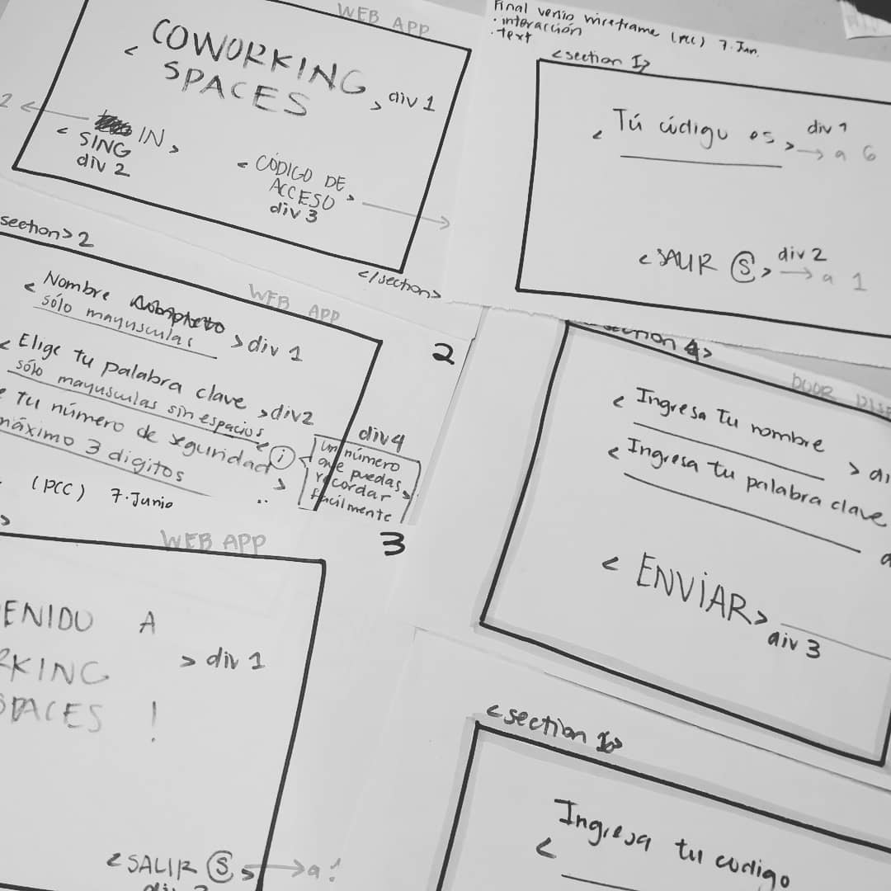

 	
# COWORKING SPACES
:closed_lock_with_key: **Controla el acceso a espacios privados dentro de instalaciones de coworking, esta app te permite crear códigos de seguridad para las personas que desees que accedan.**

## ¿Por qué existe COWORKING SPACES?
**Esta app fue creada pensando en los espacios de trabajo actuales, es común encontrar multiples start-ups conviviendo en un mismo lugar, esta nueva dinámica de espacio laboral que permite la interacción también requiere de espacios que puedan ser privados por distintos motivos ya sea seguridad o almacenamiento.**

### APP :iphone:


### Dispositivo en la puerta :door:


## ¿Cómo se usa? :question:
**Usar esta app es muy sencillo :exclamation:**
<br>
**1.  Se debe descargar la app tanto en el dispositivo móvil del usuario del espacio como en el dispositivo que permitirá el acceso, es este caso el que se encontrará en la puerta.**
<br>
**2. El usuario ingresa, en la app de su dispositivo móvil, su nombre, la palabra clave de su elección y el número de seguridad que desee, al enviar estos datos la app le devolverá un código de seguridad.**
<br>
**3. EL usuario deberá ingresar en el dispositivo de acceso (la puerta) el nombre con el que previamente se registró y el código que se le proporcionó, al enviar los datos se le permitirá el acceso en caso de ser los correctos.**

<br>
<br>
<br>

 ## Estructura de Archivos
  
  
```text
./
├── .editorconfig
├── .eslintrc
├── .gitignore
├── README.md
├── package.json
├── src
│   ├── cipher.js
│   ├── index.html
│   ├── index.js
│   └── style.css
└── test
    ├── cipher.spec.js
    ├── headless.js
    └── index.html
```
### PROCESO CREATIVO

 :bulb: :pencil2: **Wireframing**


 :bulb: :computer: **Prototipo de alta fidelidad**


:iphone: :ok_hand: **Versión final**


:mega: :mega: **Presentación** 

